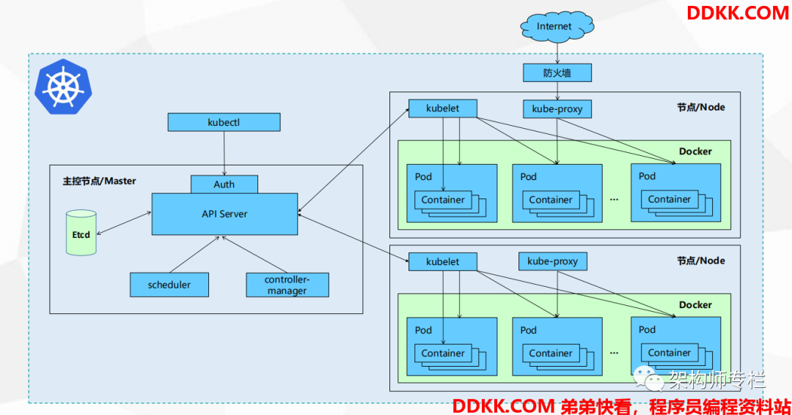

# 简介

## 1.Kubernetes 简介

Kubernetes 是由一个 Master 和多个 Node 组成，Master 通过 API 提供服务，并接收 Kubectl 发送过来的请求来调度管理整个集群。

Kubectl 是 K8s 平台的管理命令。

## 2.Kubernetes 常见组件介绍

- **APIServer：** 所有服务的统一访问入口，并提供认证、授权、访问控制、API 注册和发现等机制；
- **Controller Manager（控制器）：** 主要就是用来维持 Pod 的一个副本数，比如故障检测、自动扩展、滚动更新等；
- **Scheduler（调度器）：** 主要就是用来分配任务到合适的节点上（资源调度）
- **ETCD：** 键值对数据库，存放了 K8s 集群中所有的重要信息（持久化）
- **Kubelet：** 直接和容器引擎交互，用来维护容器的一个生命周期；同时也负责 Volume（CVI）和网络（CNI）的管理；
- **Kube-Porxy：** 用于将规则写入至 iptables 或 IPVS 来实现服务的映射访问；

**其它组件：**

- CoreDNS：主要就是用来给 K8s 的 Service 提供一个域名和 IP 的对应解析关系。
- Dashboard：主要就是用来给 K8s 提供一个 B/S 结构的访问体系（即，我们可以通过 Web 界面来对 K8s 进行管理）
- Ingress Controller：主要就是用来实现 HTTP 代理（七层），官方的 Service 仅支持 TCP\UDP 代理（四层）
- Prometheus：主要就是用来给 K8s 提供一个监控能力，使我们能够更加清晰的看到 K8s 相关组件及 Pod 的使用情况。
- ELK：主要就是用来给 K8s 提供一个日志分析平台。

**Kubernetes 工作原理：**

- 用户可以通过 Kubectl 命令来提交需要运行的 Docker Container 到 K8s 的 APIServer 组件中；
- 接着 APIServer 接收到用户提交的请求后，会将请求存储到 ETCD 这个键值对存储中；
- 然后由 Controller Manager 组件来创建出用户定义的控制器类型（Pod ReplicaSet Deployment DaemonSet 等）
- 然后 Scheduler 组件会对 ETCD 进行扫描，并将用户需要运行的 Docker Container 分配到合适的主机上；
- 最后由 Kubelet 组件来和 Docker 容器进行交互，创建、删除、停止容器等一系列操作。

`kube-proxy` 主要就是为 Service 提供服务的，来实现内部从 Pod 到 Service 和外部 NodePort 到 Service 的访问。
